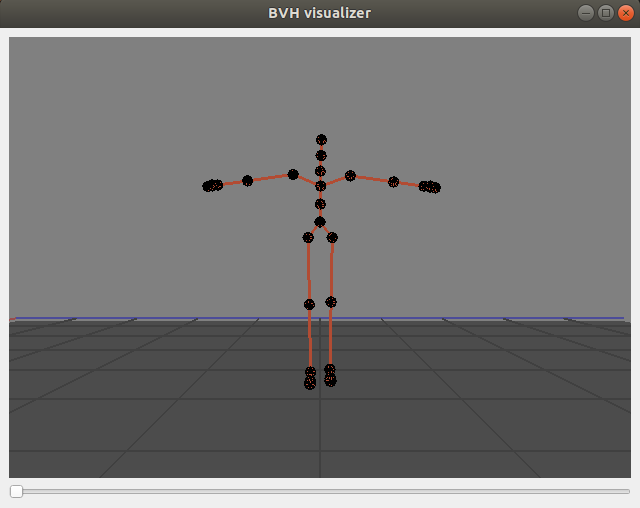

# BVH-visualizer
bvh file visualizer by PyQt and OpenGL

## Requirements
- PyQt
- PyOpenGL
- numpy

## Usage
```console
python3 visualizer.py --bvh_file=path_to_bvh
```
## Example

- silde tool for sequential display